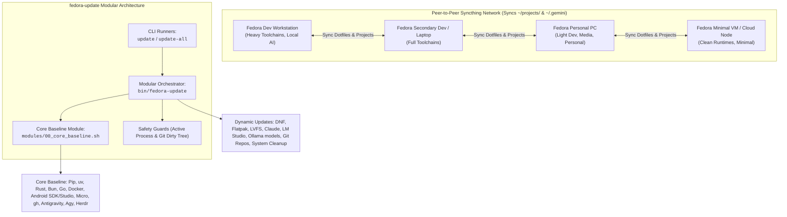

# AGENTS.md — Fedora Multi-Node Update & Maintenance Suite (`fedora-update`)

> **Repository:** [fedora-update](file:///home/jay/projects/update/fedora-update)  
> **Target OS:** Fedora Linux (Workstation, Development, VM, Personal)  
> **Sync Layer:** [Syncthing](https://syncthing.net/) (Syncs `~/.gemini` and `~/projects/`)  
> **Primary Executables:** [`update`](file:///home/jay/projects/update/fedora-update/update), [`update-all`](file:///home/jay/projects/update/fedora-update/update-all), [`bin/fedora-update`](file:///home/jay/projects/update/fedora-update/bin/fedora-update)

---

## 1. Executive Overview & System Architecture

### 1.1 Purpose & Mission
`fedora-update` is an automated, modular maintenance and toolchain synchronization system designed to keep a fleet of 3 to 5 heterogeneous Fedora computers (development workstations, personal machines, and lightweight virtual machines) completely updated, uniform, and in sync.

The environment utilizes **Syncthing** for continuous peer-to-peer synchronization of `~/.gemini` and `~/projects/`. The objective of `fedora-update` is to ensure that regardless of which physical or virtual Fedora machine the user logs into, all OS packages, development toolchains, AI agent environments, SDKs, CLI tools, documentation repositories, and system caches are fully synchronized, functional, and up to date with a **single 1-click command** (`update` or `update-all`).



---

## 2. Architecture & File Catalog

```
fedora-update/
├── AGENTS.md                   # Agent specifications & architectural manual
├── README.md                   # User documentation & quickstart
├── update                      # Top-level 1-click routine maintenance runner
├── update-all                  # Top-level 1-click maintenance + SSD TRIM runner
├── bin/
│   └── fedora-update           # Unified engine runner (supports --trim, --only=, --skip=)
├── lib/
│   ├── common.sh               # Terminal formatting, logging to ~/.local/state/update/, passwordless sudo setup
│   ├── process.sh              # Active process & agent busy detection (skip if busy, update if idle)
│   └── git_guard.sh            # Syncthing-safe Git dirty-tree checks for ~/projects/
└── modules/
    ├── 00_core_baseline.sh     # Core Fleet Baseline: installs if missing + updates
    ├── 01_system_dnf.sh        # DNF upgrade, autoremove, clean
    ├── 02_flatpak.sh           # Flatpak update + static-delta fallback + unused runtime prune
    ├── 03_firmware.sh          # LVFS hardware firmware checks (fwupdmgr)
    ├── 04_ai_runtimes.sh       # Claude Code, LM Studio, Ollama & installed models
    ├── 05_dev_toolchains.sh    # SDKMAN!, gcloud, VS Code extensions, Agent skills
    ├── 06_git_docs.sh          # Safe git pull/rebase on ~/projects/docs and Hermes
    └── 07_cleanup.sh           # Docker image prune, journalctl vacuum, optional fstrim
```

---

## 3. Fleet Tiering: Core Fleet Baseline vs Installed-Only Tools

### 3.1 Core Fleet Baseline (`modules/00_core_baseline.sh`)
*Guaranteed to be installed and kept updated on every Fedora node (Dev, Personal, or Minimal VM):*

| Component | Install Method (if missing) | Upkeep & Active Guard |
| :--- | :--- | :--- |
| **Python 3 `pip`** | `sudo dnf install -y python3-pip` | `python3 -m pip install --user --upgrade pip` |
| **Astral `uv`** | `curl -LsSf https://astral.sh/uv/install.sh \| sh` | `uv self update` |
| **NPM Global Prefix** | Set prefix to `$HOME/.npm-global` | `npm update -g` |
| **Python CLI Suite** | `uv tool install <pkg>` (or `pip install --user`) | `uv tool upgrade --all` |
| **Micro Editor** | `sudo dnf install -y micro` | `micro -plugin update` |
| **GitHub CLI (`gh`)** | `sudo dnf install -y gh` | `gh extension upgrade --all` (if authed) |
| **Rust (`rustup`)** | `curl --proto '=https' --tlsv1.2 -sSf https://sh.rustup.rs \| sh` | `rustup update` |
| **Bun Runtime** | `curl -fsSL https://bun.sh/install \| bash` | `bun upgrade` |
| **Go & Tooling** | `sudo dnf install -y golang` $\rightarrow$ `gopls` & `dlv` | Module proxy query $\rightarrow$ `go install ...@latest` |
| **Docker Engine & Compose** | Docker CE repo $\rightarrow$ `docker-ce`, `docker-compose-plugin`, enable systemd | DNF updates + `docker image prune -f` |
| **Syncthing Sync Engine** | `sudo dnf install -y syncthing` $\rightarrow$ `0.0.0.0:8384` | User systemd service + DNF updates |
| **Android CLI & SDK** | Google Commandline Tools $\rightarrow$ `~/Android/Sdk` | `android update` |
| **Android Studio Preview** | Preview archive $\rightarrow$ `~/.local/opt/android-studio-preview` | Skip if running; update if idle |
| **Antigravity Desktop** | Cloud Run Manifest $\rightarrow$ `~/.local/opt/antigravity` | Skip if running; update if idle |
| **Antigravity IDE** | Cloud Run API $\rightarrow$ `~/.local/opt/antigravity-ide` | Skip if running; update if idle |
| **Agy CLI (`agy`)** | Official installer / npm $\rightarrow$ `~/.local/bin/agy` | Skip if active; `agy update` if idle |
| **Herdr CLI (`herdr`)** | `curl -fsSL https://herdr.dev/install.sh \| bash` | Skip if active; `herdr update` if idle |

---

### 3.2 Dynamic Installed-Only Updates
*Updated if present on the host; cleanly skipped without warnings if not:*
- **OS Packages:** `dnf upgrade --refresh -y`, `dnf autoremove -y`, `dnf clean packages`.
- **Flatpaks:** `flatpak update -y` (with `--no-static-deltas` fallback), `flatpak uninstall --unused -y`.
- **Firmware:** `fwupdmgr refresh` and `fwupdmgr get-updates`.
- **Secondary AI / LLMs:** Claude Code (`claude`), LM Studio (`lms`), Ollama binary + **only currently installed models**.
- **Dev Toolchains:** SDKMAN! (`sdk update`), Google Cloud SDK (`gcloud components update`), VS Code extensions (`code --update-extensions --force`), Agent skills (`skills update`).
- **Git Repositories:** `~/projects/docs/androidx`, `compose-samples`, `horologist`, `nowinandroid`, `~/.hermes/hermes-agent`.
- **System Cleanup:** Docker dangling image prune, journalctl vacuum (14d/500MB), optional SSD TRIM (`update-all`), and reboot necessity checks (`dnf needs-restarting -r`).

---

## 4. Key Agent Operating Rules & Safety Directives

All AI agents interacting with this repository MUST adhere to these strict engineering principles:

### Rule 1: Active Agent & App Protection (Zero Interruption)
- Before modifying or updating an AI agent, IDE, or editor (Antigravity IDE/Desktop, Agy, Claude, Herdr, Android Studio, VS Code), verify whether its process is actively working via `is_app_running`.
- If the process is active, **do not replace or restart the application binary**. Skip the update for that run with an explicit notice to protect the user's active session.

### Rule 2: Syncthing Non-Interference & Git Worktree Guard
- **Never modify Syncthing configuration, `.stignore`, or Syncthing service states.**
- Before running `git pull --rebase` inside synced projects (e.g. `~/projects/docs/`), check `git status --porcelain`. If any uncommitted edits or untracked conflicts exist, cleanly bypass the pull to prevent Syncthing conflict storms across nodes.

### Rule 3: Passwordless Sudo Resilience
- Use `lib/common.sh::ensure_passwordless_sudo` to ensure non-interactive execution works seamlessly on all nodes without stalling on sudo passwords.

---

## 5. Agent Standard Operating Procedures (SOPs)

### SOP 1: Auditing a Node Fleet Configuration
1. Run `./update --help` to verify the modular engine.
2. Run `./bin/fedora-update --only=core` to verify that all Core Baseline tools are present and functional.
3. Review `~/.local/state/update/last-update.log` for deterministic execution results.

### SOP 2: Adding a New Tool to the Suite
1. Determine if the tool is a **Core Baseline** item (required on all machines) or an **Installed-Only** item.
2. If Core Baseline: add bootstrap logic and update logic in [`modules/00_core_baseline.sh`](file:///home/jay/projects/update/fedora-update/modules/00_core_baseline.sh).
3. If Installed-Only: add existence check and update logic to the appropriate module in `modules/`.
4. Validate with `bash -n` across all scripts.

### SOP 3: Bootstrapping a Brand New Node
When provisioning a fresh Fedora machine, VM, or container before Syncthing is running:
1. Clone the repository to `~/projects/update/fedora-update`.
2. Run `~/projects/update/fedora-update/install.sh`.
   * This symlinks executables to `~/.local/bin/`, installs **Syncthing**, configures the Web UI at `0.0.0.0:8384`, and enables `syncthing.service`.
3. Execute `update` to trigger one-time passwordless sudo/Polkit setup and bootstrap all compilers, Docker, Android SDK, and AI agent toolchains.

---

## 6. Repository Metadata

- **Maintainer:** Jay & Agentic Fleet
- **Current Version:** 2.0.0 (Modular Engine)
- **Primary Branch:** `main`
- **Supported Architectures:** `x86_64`, `aarch64`
